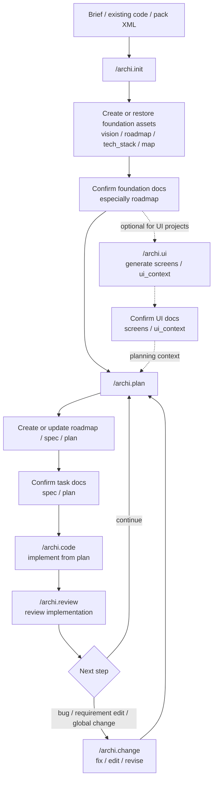

<div align="center">

[简体中文](https://github.com/JiuNian3219/architext/blob/main/README.zh-CN.md) · **English**

#  Architext

**The AI Architecture Protocol. Define first, build right.**

[](https://www.npmjs.com/package/architext)
[](LICENSE)
[](https://nodejs.org)

**Supported IDEs:** Cursor *(recommended)* · Windsurf · Trae · VS Code · Claude Code · OpenCode

</div>

> **🚧 Early-stage notice**
>
> Architext is in early development. The core workflow (init → plan → code → review) is functional, but rough edges remain. If you run into any issues, please [open an Issue](../../issues) — I'll address it quickly. Every piece of feedback directly shapes the project, and I'm grateful you're willing to try it at this stage.

---

## What is Architext?

Architext is not an AI that makes product or architecture decisions for you, and it is not another code generator. It is a **Document-Driven AI Development (DDAD)** protocol installed into your repository: the CLI deploys `.architext` docs, rules, commands, and skills; the AI commands ask questions, fill missing context, generate/update documents, and make later implementation follow those documents.

Before a single line of code is written, you decide **what** to build, **why** it matters, **where the boundaries are**, and **how success is verified**. Architext uses briefs, interviews, and confirmation gates to surface what AI does not know, records it in files like `vision`, `roadmap`, `spec`, and `plan`, then asks AI to execute against them.

> **No Docs, No Code.** Code is just a downstream artifact of documents.

Architext is best suited for **small-to-medium applications**, solo developers, or small teams working with AI. Requirements and architecture still need human judgment, but AI should not have to guess from scratch every session. You own the product direction, technical tradeoffs, feature boundaries, and acceptance criteria; Architext stores those decisions in the repo so different sessions, teammates, and AI tools can continue from the same facts.

Architext operates in two layers:

| Layer | How to trigger | Responsibility |
|:---|:---|:---|
| **CLI Tool Layer** | `npx archi <command>` | Deploy rule files, prompts, and skills into your project |
| **AI Command Layer** | `/archi.<command>` in AI chat | Generate documents, plan features, write code, audit |

The CLI layer bootstraps the project once. The AI command layer drives all development work on top of those files.

---

## Why Architext?

|  | AI Full-Agency Mode<br>*(Trae Solo / Bolt / v0)* | **Architext** |
|:---|:---|:---|
| **Core Assumption** | AI knows what you want | You make the decisions; AI needs missing context |
| **AI's Role** | Full agent — decides and executes | Question-asker + document executor |
| **Your Role** | Reviewer (see it after it's done) | Decision-maker (confirm before execution) |
| **Information Flow** | AI → You ("does this work?") | You define direction; AI asks for gaps |
| **Ownership** | AI implicitly decides the logic | You explicitly define, AI follows the docs |

> Architext does not decide for you; it asks for the decisions AI needs, records them, and keeps AI executing against them.

---

## Quick Start

**Step 1 · CLI: deploy the framework**

```bash
npm install -g architext
npx archi init
```

```
✔ Select language     › English
✔ Select IDE(s)       › Cursor   (multiselect — Cursor / Windsurf / Trae / VS Code / Claude Code / OpenCode)
✔ Select project type › Web SPA / PWA
✔ Generate project-brief.md? › Yes

● Deploying Architext...
✔ Docs deployed      → .architext/
      prompts/  global/  templates/  tasks/  refs/
✔ Rules deployed     → .cursor/rules/           (Cursor: .mdc)
      00_system · 90_custom_rules
✔ Commands deployed  → .cursor/commands/        (editors with command support)
      archi.init · archi.plan · archi.change · archi.code · archi.review · archi.ref · ...
✔ Skills deployed    → .cursor/skills/ or .architext/skills/
      archi-intent-normalizer · archi-context-fetch · archi-decompose-roadmap · archi-silent-audit · ...
✔ project-brief.md generated → project root

◆ Done! Fill in project-brief.md, then run /archi.init in your AI editor.
```

**Step 2 · AI chat: initialize your project**

When enabled, `archi init` creates a tailored `project-brief.md` at the project root. Fill it in, then run:

```
/archi.init project-brief.md
```

`/archi.init` routes automatically: an empty project + brief creates foundation assets; an existing codebase adopts current features; a pack XML restores user data. It generates or restores assets such as `vision.md`, `roadmap.json`, `tech_stack.md`, and `map.json`.

> **Existing codebase?** Still run `/archi.init`. The router detects codebase signals such as `package.json`, `go.mod`, or `Cargo.toml`, enters the inherit sub-protocol, registers existing features as `LEG-xx` tasks, and creates stub specs.

---

## How It Works

The main project lifecycle happens inside your AI chat window.



**Stage 1 · Initialize**

```
You:  /archi.init project-brief.md

AI:   [Intent Normalization: this is initialization]
      [Context Fetch: reading the brief, project files, and required global assets]
      [Route: init/start]

      ✔ ADDED:    .architext/global/vision.md
      ✔ ADDED:    .architext/global/roadmap.json
      ✔ ADDED:    .architext/global/map.json
      ✔ ADDED:    .architext/global/dictionary.json
      ✔ ADDED:    .architext/global/error_codes.json
      ✔ ADDED:    .architext/global/env_registry.json
      ✔ ADDED:    .architext/global/tech_stack.md
      ✔ ADDED:    .architext/global/design_tokens.json    (UI projects only)
      ✔ FILLED:   .cursor/rules/90_custom_rules.mdc

      Next: confirm the foundation docs, especially roadmap; run /archi.ui for UI projects and confirm the UI docs; then /archi.plan <first-task-id>
```

After initialization, review the foundation documents first: `roadmap.json` drives task breakdown and priority, `vision.md` anchors product direction, `tech_stack.md` defines implementation constraints, and `map.json` records the project structure model. If they do not match your intent, ask AI to adjust the docs before moving into `/archi.plan`.

For UI projects, also review the `/archi.ui` output before planning: `screens/` is the visual and interaction reference, and `ui_context.md` is the page-structure context used by later plan/code steps. If the screens, flows, component boundaries, or visual direction are off, adjust the UI docs before moving into `/archi.plan`.

**Stage 2 · Decompose / Plan**

`/archi.plan` is an aggregate entrypoint:
- With an existing roadmap ID, it enters the detail sub-protocol and generates `spec.md`, `plan.json`, and optional `ui.md` / `design.md`.
- With a brief file, natural-language requirement, or no argument, it enters the decompose sub-protocol and appends new tasks to `roadmap.json`.

```
You:  /archi.plan scope-brief.md

AI:   [Reading vision.md, roadmap.json, map.json, tech_stack...]
      [Scanning existing tasks for impact analysis...]

      ✔ MODIFIED: .architext/global/roadmap.json
        ADDED task FEAT-001 · auth-login        (status: pending)
        ADDED task FEAT-002 · auth-session      (status: pending, deps: FEAT-001)
```

```
You:  /archi.plan FEAT-001

AI:   [Reading task goal, dependency specs, global constraints, and matching refs]
      [Proposing feature design + architecture recommendations, then waiting for confirmation]

      ✔ ADDED:    .architext/tasks/FEAT-001_auth-login/spec.md
      ✔ ADDED:    .architext/tasks/FEAT-001_auth-login/plan.json
      ✔ ADDED:    .architext/tasks/FEAT-001_auth-login/ui.md           (UI projects only)
      ✔ MODIFIED: .architext/global/roadmap.json    (FEAT-001: pending → active)
      ✔ MODIFIED: .architext/global/map.json
      ✔ MODIFIED: .architext/global/dictionary.json
```

Before code is written, review the generated documents:
- `spec.md` — feature behavior, Gherkin acceptance criteria, interface contracts
- `plan.json` — implementation phases, file-level tasks, test mapping, decisions
- `ui.md` — interaction scope tied to `ui_context.md` screens (UI projects only)
- `design.md` — complex-task mechanisms, invariants, failure modes (when needed)

This is the task-document confirmation point: make sure `spec.md` / `plan.json` describe the product behavior, boundaries, and implementation direction you actually want. If they do not, correct the docs first with natural-language feedback or `/archi.change <ID> ...`; do not jump straight to `/archi.code`.

**Stage 3 · Implement**

```
You:  /archi.code FEAT-001

AI:   [Reading spec.md, plan.json, tech_stack.md...]
      [Status Gate: FEAT-001 is active ✔]
      [Test Quality Gate: tests must prove behavior, not merely pass]

      Implementing Phase A: Core Auth Logic
      ✔ ADDED:    src/features/auth/auth.service.ts
      ✔ ADDED:    src/features/auth/auth.controller.ts
      ✔ MODIFIED: src/app.module.ts
      ✔ MODIFIED: .architext/tasks/FEAT-001_auth-login/plan.json  (task done updated live)
```

The final `/archi.code` Gate checks `npx archi plan <ID>`, `npx archi task --check`, and `npx archi render` before marking the task `done`.

**Stage 4 · Change & Review**

`/archi.change` routes bug fixes, single-task document edits, and global revisions:

```
/archi.change FEAT-001 "login fails when password contains special chars"   # fix sub-protocol
/archi.change FEAT-001 "add a dark-mode boundary case"                      # edit sub-protocol
/archi.change "change all error codes to ERR_MODULE_REASON"                  # revise sub-protocol
```

`/archi.review` routes audits and map sync:

```
/archi.review FEAT-001      # task-level code review, writes review.md only
/archi.review               # project health review
/archi.review map           # sync map.json with the actual directory tree
```

Review checks spec-code drift, test usefulness, architecture map consistency, and global asset sync. Findings recommend `/archi.change <ID> ...` instead of editing code directly.

> **Daily development between commands** is driven by natural-language **Chat Mode**. Describe what you want in plain language. `00_system` first runs Intent Normalization, then Context Fetch, then loads the right aggregate protocol. Questions, tiny edits, and debugging can still be answered directly.

---

## Tutorials

Different scenarios, same main path. The input changes; `/archi.init` and `/archi.plan` route to the right sub-protocol.

### Scenario A: Brief covers everything

```
/archi.init project-brief.md  →  confirm foundation docs  →  [?UI] /archi.ui  →  confirm UI docs  →  /archi.plan FEAT-001  →  confirm task docs  →  /archi.code FEAT-001
```

### Scenario B: Brief is incomplete or requirements arrive later

```
/archi.init project-brief.md  →  confirm foundation docs  →  /archi.plan scope-brief.md  →  /archi.plan FEAT-001  →  confirm task docs  →  /archi.code FEAT-001
```

`/archi.plan` can append new requirements at any time; it is now a router, not only a deep-planning command.

### Scenario C: Adopt an existing codebase

```
npx archi init  →  /archi.init [project-brief.md]  →  confirm foundation docs  →  /archi.change LEG-xx complete the stub spec  →  /archi.code LEG-xx
```

### Tutorial D: Bug fix

```
/archi.change FEAT-001 "login fails when password contains special chars"
```

### Tutorial E: External references

```
/archi.ref add https://example.com/api-docs
/archi.ref list
/archi.ref update stripe-api
/archi.ref remove stripe-api
```

`update` and `remove` show overwrite/delete impact and wait for confirmation before writing.

---

## Commands

### AI Chat Commands

You can trigger these either by typing `/archi.<command>` or by describing your intent in natural language. Public commands are aggregate entrypoints; Intent Card + Context Pack select the concrete sub-protocol.

| Command | Description |
|:---|:---|
| `/archi.init [brief-or-pack]` | Initialize a project, adopt existing code, or recover from pack; generates or restores foundation docs that must be reviewed afterward |
| `/archi.plan [ID|brief|requirement]` | Without an ID: decompose new requirements; with an ID: generate or refine that task's spec / plan |
| `/archi.code <ID>` | Implement phase by phase from plan; only `active` tasks are allowed |
| `/archi.change [ID] <context>` | Routes to fix / edit / revise: bug repair, task doc change, or global revision |
| `/archi.review [ID|map]` | Task review, project health review, or map.json sync |
| `/archi.ui` | Generate or incrementally update UI concept designs; review `screens/` and `ui_context.md` afterward; production code must reimplement in the project stack |
| `/archi.ref <add|list|update|remove>` | Manage external knowledge refs for tag-based context injection |
| `/archi.remove <ID>` | Decommission a feature after showing impact and receiving confirmation |
| `/archi.help [question]` | Recommend the next action or answer by locating relevant files |

### CLI Commands

| Command | Purpose |
|:---|:---|
| `npx archi init` | Deploy framework files: rules, prompts, skills, templates, and global seeds |
| `npx archi update` | Update framework-owned files without overwriting user data |
| `npx archi doctor` | Check project health |
| `npx archi render` | Generate readable Markdown views from JSON data |
| `npx archi task [--check]` | View / validate roadmap task status |
| `npx archi task <ID> --status <status>` | Update task status |
| `npx archi plan <id>` | Check plan completion for a task |
| `npx archi pack [-o file]` | Pack user data into an XML backup |
| `npx archi template <name>` | Copy a template file to the project root |
| `npx archi uninstall` | Remove Architext framework files from the project |

## Core Philosophy

**① Document-Driven AI Development (DDAD)**

Code is a downstream artifact of documents. Every change starts with a document update — spec first, code second. This makes every decision traceable and every AI output predictable.

**② User Agency**

AI's job is to surface and clarify your intent — not replace your judgment. You see the complete feature logic, data flow, and interaction model *before* development begins. All critical decisions stay in your hands.

**③ Executable Architecture Conventions**

Architext does not choose an architecture for you. It records your chosen conventions in docs, rules, and review gates, so AI work has a stable boundary to follow and drift becomes visible when it happens.

---

## A Note on Vision

The AI development landscape is evolving at a pace none of us fully anticipated. New models, new tools, new paradigms — every few months, the ground shifts again.

Architext is my attempt to bring some structure to how we work *with* AI in software development. It's not a claim to have found the definitive answer. It's one direction that made sense to me — grounded in the idea that clear thinking before coding leads to better outcomes, regardless of how powerful the AI becomes.

If it's useful to you, great. If you see a better way, I genuinely want to hear it.

---

## FAQ

**Q: I already use an AI editor. Why do I need Architext?**

Architext does not replace Cursor, Claude Code, Windsurf, or any other AI editor. It provides a project-level protocol: requirements, architecture decisions, task plans, reviews, and context assets live in the repo so different sessions and tools can work from the same source of truth.

---

**Q: Can I use this on an existing codebase?**

Yes. Run `npx archi init` first to deploy the framework, then run `/archi.init`. The init router detects the existing codebase and enters the inherit sub-protocol: it analyzes current code, fills the document skeleton without overwriting existing content, and registers existing features as `LEG-xx` tasks with stub specs.

> **Note**: the inherit sub-protocol is still early-stage. Analysis results for large or complex repos may be incomplete and require manual cleanup. Feel free to open an Issue if you hit problems.

---

**Q: Which IDEs are supported?**

Four IDEs are currently supported. During `archi init` you manually select which ones to deploy (multiselect, any combination):

| IDE | Rules directory | Extension | Status |
|:---|:---|:---|:---|
| Cursor | `.cursor/rules/` | `.mdc` | Recommended — most thoroughly tested |
| Windsurf | `.windsurf/rules/` | `.md` | Supported |
| Trae | `.trae/rules/` | `.md` | Supported |
| VS Code | `.github/instructions/` | `.instructions.md` | Supported |
| Claude Code | `.claude/rules/` | `.md` | Supported |
| OpenCode | `.opencode/rules/` | `.md` | Supported |

Support for additional editors is planned.

---

**Q: Does this work for non-web projects?**

Yes. Architext is architecture-agnostic and project-type-agnostic. It works for CLI tools, Web apps, mini-programs, APIs, backend services, and embedded systems. The templates adapt to your project type during initialization.

---

**Q: Do I have to use every command?**

No. You can start with just `/archi.plan` + `/archi.code` and gradually adopt the rest as your team gets comfortable. The system is designed to be incrementally adoptable.

---

**Q: Is token consumption high?**

Yes. Each command loads multiple context files and performs deep analysis — **token usage is noticeably higher than casual prompting**. This is an inherent cost of document-driven development; the tradeoff is more predictable outputs and far fewer "wait, that's not what I meant" cycles.

---

<div align="center">

**[Contributing](https://github.com/JiuNian3219/architext/blob/main/CONTRIBUTING.md) · [Changelog](https://github.com/JiuNian3219/architext/blob/main/CHANGELOG.md) · [Issues](https://github.com/JiuNian3219/architext/issues)**

> This is Architext: a development protocol that connects requirements, documents, and AI execution.

</div>
