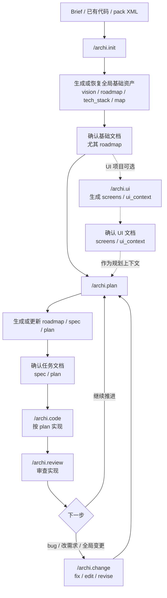

<div align="center">

**简体中文** · [English](https://github.com/JiuNian3219/architext/blob/main/README.md)

#  Architext

**AI 原生架构协议 · 先想清楚，再让 AI 实现**

[](https://www.npmjs.com/package/architext)
[](LICENSE)
[](https://nodejs.org)

**支持的 IDE：** Cursor · Windsurf · Trae · VS Code · Claude Code · OpenCode

</div>

> **🚧 项目早期公告**
>
> Architext 目前处于早期阶段。核心工作流（init → plan → code → review）已基本跑通，但仍有不少细节有待打磨。如果你在使用中遇到任何问题，欢迎[提交 Issue](../../issues) —— 我会尽快跟进修复。你的每一条反馈都会直接推动项目成长，感谢你愿意在早期就参与进来。

---

## 这是什么？

Architext 不是替你做产品/架构决策的 AI，也不是另一个代码生成器。它是一套放进仓库里的**文档驱动 AI 开发 (DDAD)** 协议：CLI 负责部署 `.architext` 文档、规则、命令和 Skills；AI 命令负责在开发过程中提问、补齐上下文、生成/更新文档，并让后续实现按这些文档执行。

在写下任何一行代码之前，你先决定**要构建什么**、**为什么要做**、**边界在哪里**、**怎样验收**。Architext 通过 brief、问答和确认步骤，把 AI 不知道的信息问出来、写进 `vision`、`roadmap`、`spec`、`plan` 等文件，再让 AI 照着执行。

> **无文档，不代码。** 代码只是文档的下游产物。

Architext 更适合**中小型应用**、个人开发者或小团队 + AI 的场景：需求和架构还需要人来拍板，但希望 AI 不要每次都从零猜。你的产品方向、技术取舍、功能边界和验收标准仍由你决定；Architext 负责把这些决定沉淀到仓库里，让不同会话、不同成员、不同 AI 工具都能沿着同一套事实继续工作。

Architext 以两个层次协同运作：

| 层次 | 触发方式 | 职责 |
|:---|:---|:---|
| **CLI 工具层** | `npx archi <命令>` | 将规则文件、Prompt、Skills 部署到项目中 |
| **AI 命令层** | 在 AI 编辑器中输入 `/archi.<命令>` | 生成文档、规划功能、编写代码、审查修复 |

CLI 层负责一次性部署框架，AI 命令层在这些文件的基础上驱动所有开发工作。

---

## 为什么选择 Architext？

|  | AI 全权代理模式<br>*(Trae Solo / Bolt / v0)* | **Architext** |
|:---|:---|:---|
| **核心假设** | AI 知道用户要什么 | 用户负责决定，AI 需要补齐上下文 |
| **AI 的角色** | 全权代理人 | 提问者 + 文档执行者 |
| **你的角色** | 验收者（做完了才知道是什么） | 决策者（确认后再执行） |
| **信息流向** | AI → 用户（"你看这行不行"） | 用户定义方向，AI 追问缺口 |
| **决策权** | AI 隐式决定功能逻辑 | 用户显式定义，AI 按文档执行 |

> Architext 不替你决定；它把需要你决定的地方问出来、记下来，并约束 AI 照着做。

---

## 快速开始

**第一步 · CLI：部署框架**

```bash
npm install -g architext
npx archi init
```

```
✔ 选择语言      › 简体中文
✔ 选择 IDE      › Cursor   (多选 — Cursor / Windsurf / Trae / VS Code / Claude Code / OpenCode)
✔ 选择项目类型  › Web SPA / PWA
✔ 是否生成 project-brief.md？ › 是

● 正在部署 Architext...
✔ 文档已部署       → .architext/
      prompts/  global/  templates/  tasks/  refs/
✔ 规则文件已部署   → .cursor/rules/           (Cursor: .mdc)
      00_system · 90_custom_rules
✔ 命令文件已部署   → .cursor/commands/         (仅支持命令文件的编辑器)
      archi.init · archi.plan · archi.change · archi.code · archi.review · archi.ref · ...
✔ Skills 已部署    → .cursor/skills/ 或 .architext/skills/
      archi-intent-normalizer · archi-context-fetch · archi-decompose-roadmap · archi-silent-audit · ...
✔ project-brief.md 已生成 → 项目根目录

◆ 完成！填写 project-brief.md，然后在 AI 编辑器中运行 /archi.init。
```

**第二步 · AI 对话：初始化项目**

选择生成时，`archi init` 会在项目根目录生成 `project-brief.md`。填写完毕后，在 AI 编辑器中运行：

```
/archi.init project-brief.md
```

`/archi.init` 会根据当前目录自动路由：空项目 + Brief 会生成基础资产；已有代码库会纳管现有功能；传入 pack XML 会恢复用户数据。它会生成或恢复 `vision.md`、`roadmap.json`、`tech_stack.md`、`map.json` 等基础资产。

> **已有代码？** 仍然运行 `/archi.init`。路由器会识别 `package.json` / `go.mod` / `Cargo.toml` 等代码库信号，进入 inherit 子协议，把已有功能注册为 `LEG-xx` 任务并生成 Stub spec。

---

## 工作流示例

项目全生命周期的主干路径，全部在 AI 对话框中完成。



**第一阶段 · 初始化**

```
你:   /archi.init project-brief.md

AI:   [Intent Normalization: 判断这是初始化]
      [Context Fetch: 读取 Brief、项目文件和必要全局资产]
      [路由: init/start]

      ✔ 新增:    .architext/global/vision.md
      ✔ 新增:    .architext/global/roadmap.json
      ✔ 新增:    .architext/global/map.json
      ✔ 新增:    .architext/global/dictionary.json
      ✔ 新增:    .architext/global/error_codes.json
      ✔ 新增:    .architext/global/env_registry.json
      ✔ 新增:    .architext/global/tech_stack.md
      ✔ 新增:    .architext/global/design_tokens.json    (仅 UI 类项目)
      ✔ 填充:    .cursor/rules/90_custom_rules.mdc

      下一步：先确认基础文档，尤其 roadmap；UI 项目再运行 /archi.ui 并确认 UI 文档；然后 /archi.plan <首个任务ID>
```

初始化完成后先审阅基础文档：`roadmap.json` 决定后续任务拆分和优先级，`vision.md` 决定产品方向，`tech_stack.md` 决定实现约束，`map.json` 决定项目结构认知。若这些内容不符合你的真实意图，先让 AI 调整文档，不要直接进入 `/archi.plan`。

UI 项目运行 `/archi.ui` 后也要确认文档：`screens/` 是视觉和交互参照，`ui_context.md` 是后续 plan/code 理解页面结构的依据。若页面、流程、组件边界或视觉方向不符合心意，先调整 UI 文档，不要直接进入 `/archi.plan`。

**第二阶段 · 需求分解 / 深度规划**

`/archi.plan` 是聚合入口：
- 带已有 Roadmap ID：进入 detail 子协议，生成 `spec.md` / `plan.json` / 可选 `ui.md`、`design.md`。
- 带 brief 文件、自然语言需求或无参数：进入 decompose 子协议，把新需求追加到 `roadmap.json`。

```
你:   /archi.plan scope-brief.md

AI:   [读取 vision.md, roadmap.json, map.json, tech_stack...]
      [扫描现有任务，评估影响范围...]

      ✔ 更新: .architext/global/roadmap.json
        新增任务 FEAT-001 · auth-login        (状态: pending)
        新增任务 FEAT-002 · auth-session      (状态: pending, 依赖: FEAT-001)
```

```
你:   /archi.plan FEAT-001

AI:   [读取任务目标、依赖 spec、全局约束和相关 refs]
      [输出功能设计 + 架构建议，等待确认]

      ✔ 新增:    .architext/tasks/FEAT-001_auth-login/spec.md
      ✔ 新增:    .architext/tasks/FEAT-001_auth-login/plan.json
      ✔ 新增:    .architext/tasks/FEAT-001_auth-login/ui.md          (仅 UI 类项目)
      ✔ 更新:    .architext/global/roadmap.json    (FEAT-001: pending → active)
      ✔ 更新:    .architext/global/map.json
      ✔ 更新:    .architext/global/dictionary.json
```

代码动工前，审阅生成的规格文档：
- `spec.md` — 功能逻辑、Gherkin 验收标准、接口契约
- `plan.json` — 实施阶段、文件级任务拆解、测试映射、决策记录
- `ui.md` — 交互说明，对照 `ui_context.md` 中的屏幕定义（仅 UI 类项目）
- `design.md` — 复杂任务的机制设计、不变量、失败模式（按需生成）

这一步需要你确认任务文档：`spec.md` / `plan.json` 写出来的是不是你真正想要的产品行为、边界和实现方向。若不符合心意，先用自然语言指出问题，或运行 `/archi.change <ID> ...` 调整文档；不要直接进入 `/archi.code`。

**第三阶段 · 实现**

```
你:   /archi.code FEAT-001

AI:   [读取 spec.md, plan.json, tech_stack.md...]
      [状态门控：FEAT-001 状态为 active ✔]
      [测试质量门控：测试必须验证真实行为，而不是只为通过]

      正在实现 Phase A：核心认证逻辑
      ✔ 新增:    src/features/auth/auth.service.ts
      ✔ 新增:    src/features/auth/auth.controller.ts
      ✔ 更新:    src/app.module.ts
      ✔ 更新:    .architext/tasks/FEAT-001_auth-login/plan.json  (task done 实时更新)
```

`/archi.code` 的最终 Gate 会先检查 `npx archi plan <ID>`、`npx archi task --check`、`npx archi render`，全部通过后才把任务标记为 `done`。

**第四阶段 · 变更与审查**

`/archi.change` 是 bug、单任务需求变更、全局架构变更的聚合入口：

```
/archi.change FEAT-001 "密码含特殊字符时登录失败"     # fix 子协议
/archi.change FEAT-001 "补一个深色模式边界场景"       # edit 子协议
/archi.change "全局错误码改成 ERR_MODULE_REASON"      # revise 子协议
```

`/archi.review` 是审查入口：

```
/archi.review FEAT-001      # task 级代码审查，只写 review.md
/archi.review               # project 级体检
/archi.review map           # map.json 与目录结构同步
```

审查会检查 spec-code 漂移、测试有效性、架构地图、全局资产同步等问题；发现 bug 会建议 `/archi.change <ID> ...`，而不是直接修改。

> **命令之间的日常开发**由自然语言 **Chat Mode** 驱动。用自然语言描述需求（如「加个登录功能」「修一下认证的 bug」），`00_system` 会先做 Intent Normalization，再用 Context Fetch 读取必要文件，最后加载对应聚合协议。提问、琐碎修改、调试则直接回答。

---

## 教程

不同场景，同一条主干路径。输入不同，`/archi.init` 和 `/archi.plan` 会自动路由到对应子协议。

### 场景 A：Brief 已覆盖全部需求

```
/archi.init project-brief.md  →  确认基础文档  →  [?UI] /archi.ui  →  确认 UI 文档  →  /archi.plan FEAT-001  →  确认任务文档  →  /archi.code FEAT-001
```

### 场景 B：Brief 不完整或后续追加功能

```
/archi.init project-brief.md  →  确认基础文档  →  /archi.plan scope-brief.md  →  /archi.plan FEAT-001  →  确认任务文档  →  /archi.code FEAT-001
```

`/archi.plan` 可随时追加新需求；它不再是单纯的“深度规划”命令，而是 plan 路由器。

### 场景 C：已有代码库纳管

```
npx archi init  →  /archi.init [project-brief.md]  →  确认基础文档  →  /archi.change LEG-xx 补全 Stub  →  /archi.code LEG-xx
```

### 教程 D：Bug 修复

```
/archi.change FEAT-001 "密码含特殊字符时登录失败"
```

### 教程 E：外部资料引用

```
/archi.ref add https://example.com/api-docs
/archi.ref list
/archi.ref update stripe-api
/archi.ref remove stripe-api
```

`update` / `remove` 会先展示覆盖或删除影响范围，等待确认后再写入。

---

## 命令速查

### AI 对话命令

可通过输入 `/archi.<命令>` 或直接用自然语言描述意图触发。公开命令是聚合入口，具体子协议由 Intent Card + Context Pack 路由。

| 命令 | 说明 |
|:---|:---|
| `/archi.init [brief-or-pack]` | 初始化项目、纳管已有代码或从 pack 恢复；生成或恢复基础文档，之后需要确认 roadmap 等内容 |
| `/archi.plan [ID|brief|需求描述]` | 无 ID 时分解新需求；有 ID 时生成或细化该任务的 spec / plan |
| `/archi.code <ID>` | 按 plan 分阶段实现代码；仅 `active` 任务可进入 |
| `/archi.change [ID] <context>` | 路由到 fix / edit / revise：修 bug、改单任务文档、或做全局变更 |
| `/archi.review [ID|map]` | 任务审查、项目体检，或 map.json 同步 |
| `/archi.ui` | 生成或增量更新 UI 概念设计；之后需要确认 `screens/` 和 `ui_context.md`；生产代码必须用项目语言重实现 |
| `/archi.ref <add|list|update|remove>` | 管理外部知识引用，供 plan/code 按 tags 注入上下文 |
| `/archi.remove <ID>` | 下线功能：先输出影响范围并确认，再删除代码/文档并清理引用 |
| `/archi.help [question]` | 无参数推荐下一步；有问题时定位相关文件回答 |

### 终端命令

| 命令 | 用途 |
|:---|:---|
| `npx archi init` | 部署框架文件（规则、Prompt、Skills、模板和全局种子文件） |
| `npx archi update` | 将已部署框架文件更新至最新版本，不覆盖用户数据 |
| `npx archi doctor` | 检查项目健康状态 |
| `npx archi render` | 将 JSON 数据生成可读 Markdown 视图 |
| `npx archi task [--check]` | 查看/校验 Roadmap 任务状态 |
| `npx archi task <ID> --status <status>` | 更新任务状态 |
| `npx archi plan <id>` | 检查指定任务的 plan 完成度 |
| `npx archi pack [-o file]` | 打包用户数据为 XML 备份文件 |
| `npx archi template <name>` | 获取模板文件到项目根目录 |
| `npx archi uninstall` | 从项目中移除 Architext 框架文件 |

## 核心哲学

**① 文档驱动 (DDAD)**

代码是文档的下游产物。每次变更都从修改文档开始——先有规格，再有代码。每一个决策都可追溯，每一个 AI 输出都可预期。

**② 用户主权**

AI 的职责是挖掘和澄清你的真实意图，而非替代你做判断。在开发开始之前，你就能看到完整的功能逻辑、数据流和交互模型。所有关键决策的最终决定权在你手中。

**③ 架构约定可执行化**

Architext 不替你选择架构。它把你选定的架构约定写进文档、规则和检查流程里，让 AI 更容易沿着这些边界工作；如果实现偏离约定，审查和 Gate 会把问题暴露出来。

---

## 关于愿景

AI 开发的演进速度，比我们任何人预想的都要快。新模型、新工具、新范式——几乎每隔几个月，整个行业就会重新洗牌一次。

Architext 是我在这个方向上的一次探索：尝试为"如何与 AI 协作开发软件"这件事提供一些结构。它并不是一个宣称找到了终极答案的框架，只是我认为行得通的一个方向——核心信念是：动手之前想清楚，无论 AI 变得多强大，都会带来更好的结果。

如果它对你有用，那很好。如果你有更好的想法，我真的很想听。

---

## 常见问题

**我已经有 AI 编辑器了，为什么还需要 Architext？**

Architext 不替代 Cursor、Claude Code、Windsurf 这类 AI 编辑器。它提供的是项目级协议：把需求、架构约定、任务计划、审查结果和上下文资产放进仓库，让不同会话和不同工具都能围绕同一套文档工作。

---

**我的已有项目能用吗？**

可以。先运行 `npx archi init` 部署框架，再运行 `/archi.init`。init 路由器会识别已有代码库并进入 inherit 子协议，分析现有代码、填充文档骨架（非覆盖既有内容），并把已有功能注册为 `LEG-xx` Stub spec，渐进式接入，无需推倒重来。

> **注意**：inherit 子协议仍处于早期阶段，对大型或复杂仓库的分析结果可能不够完整，需要手动补充。欢迎提交 Issue 反馈遇到的问题。

---

**支持哪些 IDE？**

目前支持 4 个 IDE，在 `archi init` 交互式选择中手动勾选，支持多选，可同时为多个 IDE 部署：

| IDE | 规则目录 | 扩展名 | 状态 |
|:---|:---|:---|:---|
| Cursor | `.cursor/rules/` | `.mdc` | 推荐 — 测试最完善 |
| Windsurf | `.windsurf/rules/` | `.md` | 支持 |
| Trae | `.trae/rules/` | `.md` | 支持 |
| VS Code | `.github/instructions/` | `.instructions.md` | 支持 |
| Claude Code | `.claude/rules/` | `.md` | 支持 |
| OpenCode | `.opencode/rules/` | `.md` | 支持 |

后续计划扩展更多编辑器支持。

---

**支持哪些项目类型？**

不绑定特定项目类型。CLI 工具、Web 应用、小程序、API、后端服务均适用。模板在初始化时会根据项目类型自动适配。

---

**必须用全部命令吗？**

不必。可以只从`/archi.init` + `/archi.plan` + `/archi.code` 开始，随着熟悉程度逐步引入其他命令。整个系统按照渐进式接入的方式设计。

---

**Token 消耗大吗？**

是的，相比普通对话，Architext 的每条命令都会加载多个上下文文件并执行深度分析，**Token 消耗明显高于直接提问**。这是文档驱动开发的固有成本——换来的是更可预期的输出和更少的反复。

---

<div align="center">

**[贡献指南](https://github.com/JiuNian3219/architext/blob/main/CONTRIBUTING.md) · [更新日志](https://github.com/JiuNian3219/architext/blob/main/CHANGELOG.md) · [Issues](https://github.com/JiuNian3219/architext/issues)**

> 这就是 Architext：一套把需求、文档和 AI 执行连接起来的开发协议。

</div>
