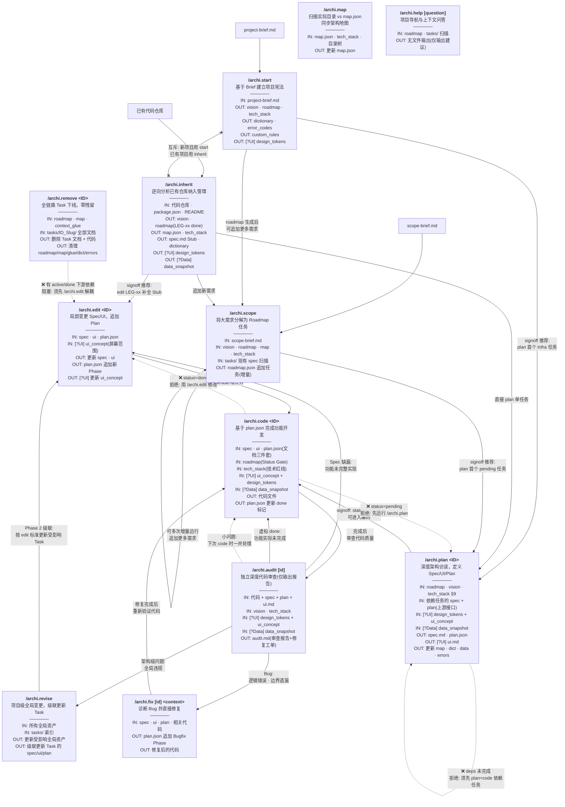
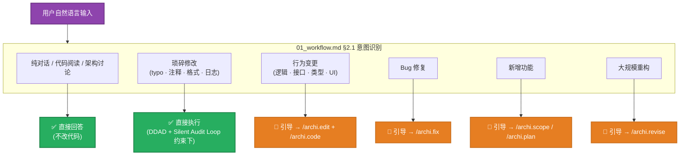
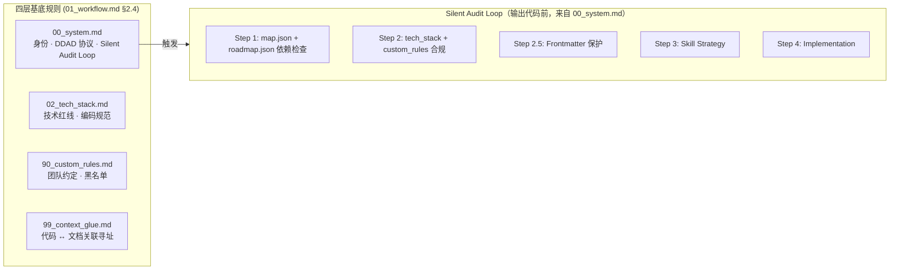
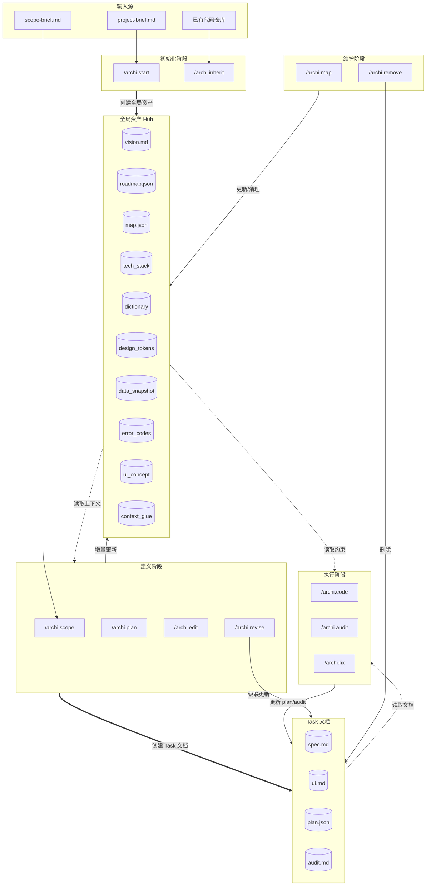
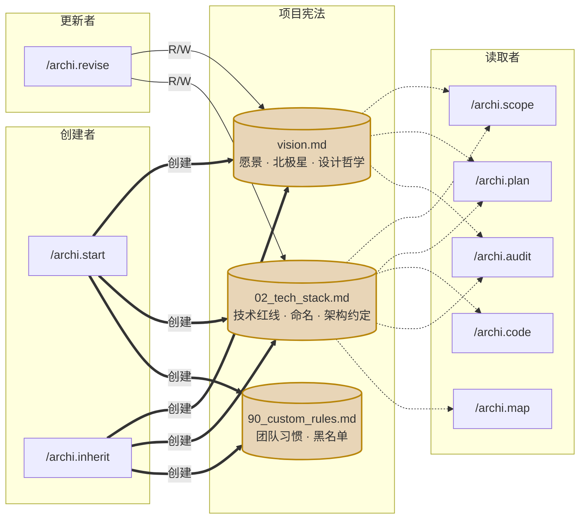
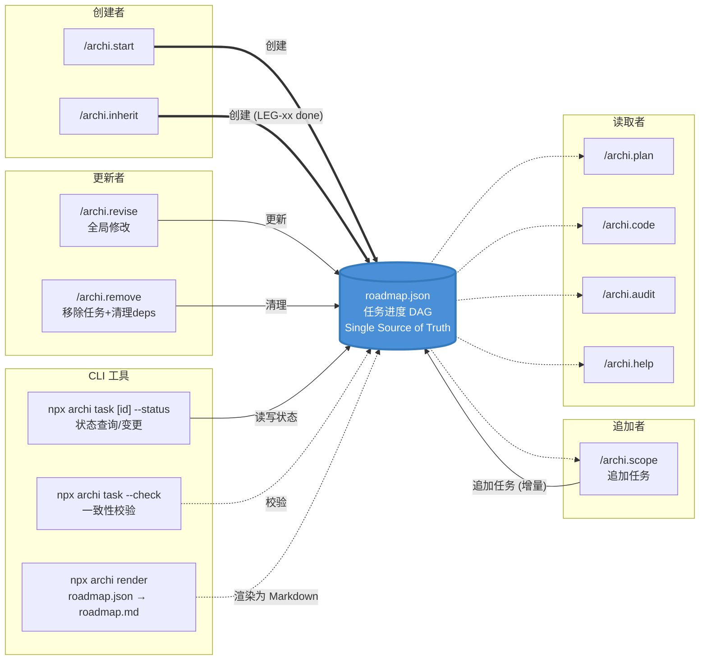
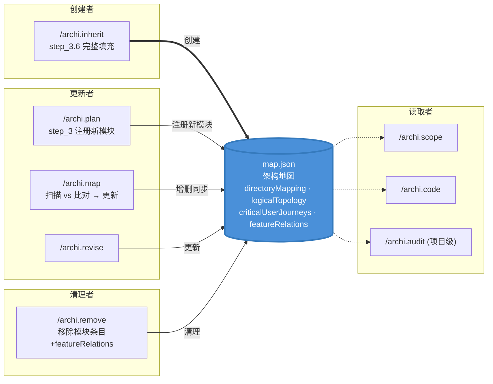
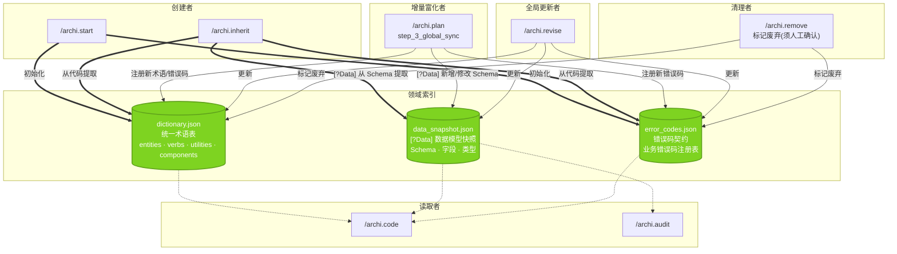
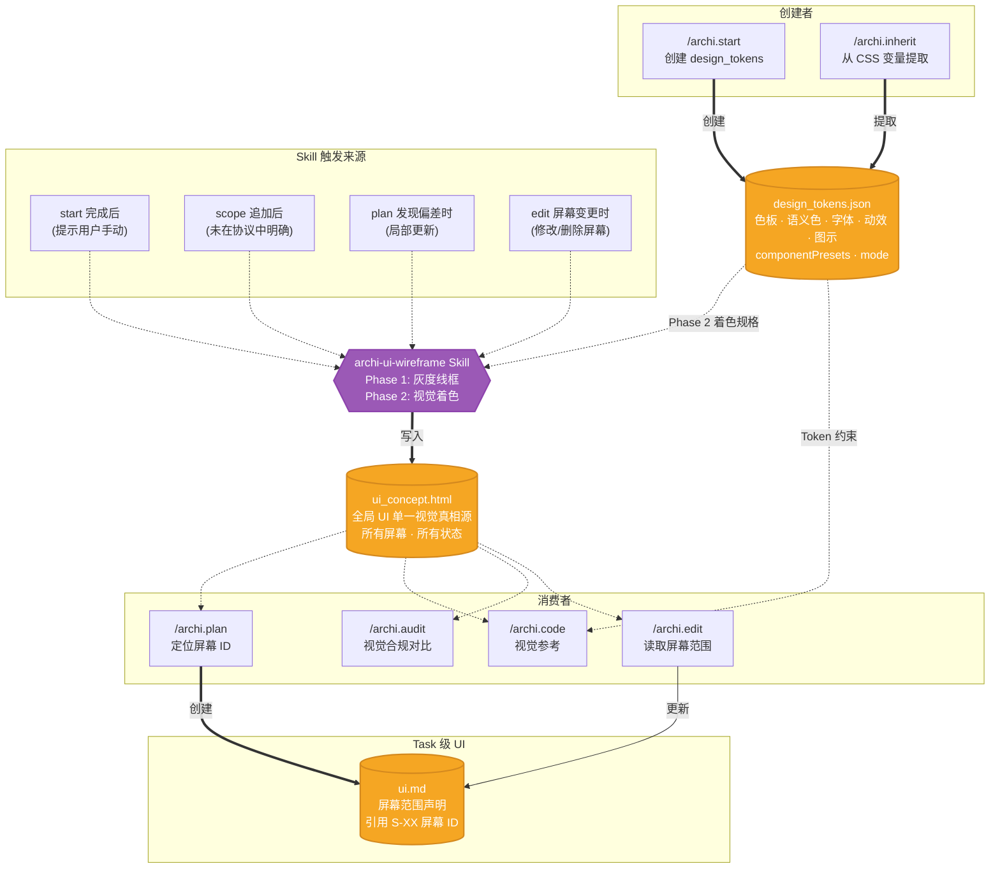
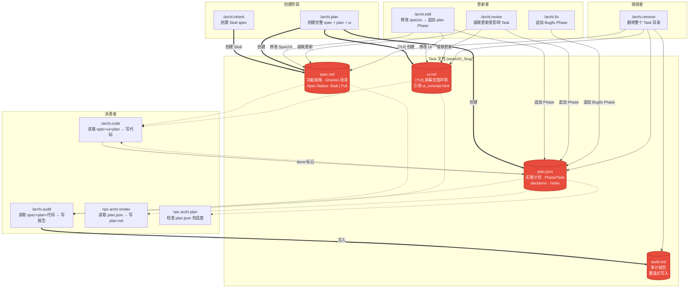

# Architext 架构参考

> **受众**：希望深入理解 Architext 内部机制的贡献者，以及需要精确了解命令行为的 AI 助手。
> **定位**：本文档是 Architext 命令层与资产层的精确技术参考，不是入门教程。
> 如需快速上手，请先阅读 [README](../README.zh-CN.md)；如需贡献代码，请先阅读 [CONTRIBUTING](../CONTRIBUTING.md)。

---

# 全局资产与命令流转图

> 箭头约定: `-->` 正常流转 | `-.->` Gate 拒绝/重定向 | `x--x` 互斥
> Mermaid 节点中 `IN:` 标注输入资产，`OUT:` 标注输出资产，`[?UI]` / `[?Data]` 表示仅特定项目类型涉及。

---

## 概览：双层架构

Architext 以 **两个层次** 协同运作：

| 层次 | 触发方式 | 工具 | 职责 |
|:---|:---|:---|:---|
| **CLI 工具层** | `npx archi <command>` | 终端命令 | 初始化框架、同步规则、任务管理、健康检查 |
| **AI 命令层** | `/archi.<command>` | AI 编辑器 Prompt | 文档生成、架构规划、代码实现、审查修复 |

CLI 层负责将 AI 命令层所需的 prompt 文件、规则文件、Skills 等**部署到用户项目**，AI 层在这些文件的基础上驱动 AI 完成开发工作。

---

## 0. AI 命令全景图

**12 个 AI 命令的完整逻辑关系**: 包含所有正向流转、Gate 重定向、审查分流回路、级联链路。
独立命令（无前后依赖）放在右侧单独成线。



### 全景图阅读指南

**主干路径** (从上往下):
```
project-brief → start → scope → plan → code → audit
```

> 此图仅展示 `/archi.*` 命令之间的流转关系。
> 自然语言交互（Chat Mode）是独立的调度层，见 Section 0.3。

**三条修复回路** (从 audit 回到 code):
```
回路 A: audit → fix → code → audit (Bug 修复)
回路 B: audit → edit → code → audit (Spec 补充)
回路 C: audit → revise → edit → code → audit (架构级修复)
```

**Gate 重定向** (虚线箭头):
- `code` 的 Status Gate 根据任务状态拒绝并指向正确命令
- `plan` 的依赖检查拒绝并要求先完成依赖链
- `remove` 的依赖安全检查阻塞并要求先解耦

---

## 0.1 命令输入输出详表

每个资产附一句话作用描述。`[?UI]` `[?Data]` 表示仅特定项目类型涉及。

### 初始化阶段

#### /archi.start — 基于 Brief 建立项目宪法

| 方向 | 资产 | 作用 |
|:---|:---|:---|
| 输入 | `project-brief.md` | 用户填写的项目需求、功能清单、技术偏好、设计调性 |
| 输出 | `vision.md` | 项目愿景、北极星指标、设计哲学、目标用户、边界约束 |
| 输出 | `roadmap.json` | 任务进度 DAG，含功能列表、阶段划分、依赖关系 |
| 输出 | `02_tech_stack.md` | 技术红线、命名规范、架构约定、§9 项目全局约定 |
| 输出 | `90_custom_rules.md` | 用户自定义团队习惯、技术黑名单、编码偏好 |
| 输出 | `dictionary.json` | 统一术语表，消除项目内同一概念多种叫法 |
| 输出 | `error_codes.json` | 错误码契约，预定义核心业务错误码 |
| 输出 [?UI] | `design_tokens.json` | 视觉物理量：色板、语义色、字体、动效、图示风格 |

#### /archi.inherit — 逆向分析已有代码仓库，纳入框架管理

| 方向 | 资产 | 作用 |
|:---|:---|:---|
| 输入 | 已有代码仓库 | package.json/README/目录结构/核心模块源码 |
| 输出 | `vision.md` | 从 README 和代码推导的项目愿景（AI 补全项标注置信度） |
| 输出 | `roadmap.json` | LEG-xx 任务（status=done），映射已有功能模块 |
| 输出 | `map.json` | 架构地图：目录映射、逻辑拓扑、用户旅程、聚合关系 |
| 输出 | `02_tech_stack.md` | 从依赖和配置文件提取的技术栈声明 |
| 输出 | `90_custom_rules.md` | 从 eslint/prettier/editorconfig 提取的已有规范 |
| 输出 | `spec.md` (Stub) | 每个 LEG 任务的轻量功能快照（概述+关键流程+关联文件） |
| 输出 | `dictionary.json` | 从代码提取的领域术语和命名约定 |
| 输出 | `error_codes.json` | 从代码中的错误定义提取的错误码 |
| 输出 [?UI] | `design_tokens.json` | 从 CSS 变量/主题配置提取的视觉 Token |
| 输出 [?Data] | `data_snapshot.json` | 从 Schema/Migration 提取的数据模型快照 |

### 定义阶段

#### /archi.scope — 将大需求分解为多个 Roadmap 任务

| 方向 | 资产 | 作用 |
|:---|:---|:---|
| 输入 | `scope-brief.md` | 需求名称、功能清单、边界约束、受影响的已有功能 |
| 读取 | `vision.md` | Vision 对齐检查：新需求是否偏离北极星 |
| 读取 | `roadmap.json` | 当前任务列表、Phase 结构、ID 编号水位 |
| 读取 | `map.json` | 架构拓扑，判断新模块归属；featureRelations 联动检查 |
| 读取 | `02_tech_stack.md` | 技术约束，影响任务分解粒度 |
| 读取 | `tasks/` 目录 | 扫描已有 Task 概要，评估影响 |
| 输出 | `roadmap.json` (追加) | 增量追加新任务到对应 Phase，禁重写已有任务 |

#### /archi.plan \<ID\> — 深度架构访谈，定义功能的 Spec/UI/Plan

| 方向 | 资产 | 作用 |
|:---|:---|:---|
| 读取 | `roadmap.json` | 解析任务信息、Pre-flight 依赖检查 |
| 读取 | `vision.md` | 提取北极星指标和设计哲学，方案须与此对齐 |
| 读取 | `02_tech_stack.md` | 技术红线 + §9 项目约定（Error Handling / Data Flow / Auth） |
| 读取 | 依赖任务的 `spec.md` + `plan.json` | 上游接口契约和已实现内容，确保对接精确 |
| IN: [?UI] | `design_tokens.json` | 视觉约束，供 UI 设计参考 |
| IN: [?UI] | `ui_concept.html` | 定位本功能对应的屏幕 ID 和状态范围 |
| IN: [?Data] | `data_snapshot.json` | 已有数据模型，避免重复定义 |
| 输出 | `spec.md` | 功能规格：Gherkin 场景、接口/类型定义 |
| 输出 | `plan.json` | 实施步骤：Phase/Task 拆解、decisions、验证方式 |
| 输出 [?UI] | `ui.md` | 屏幕范围声明，引用 ui_concept.html 的屏幕 ID |
| OUT: 更新 | `map.json` | directoryMapping 注册新模块；logicalTopology 定义依赖 |
| OUT: 更新 | `dictionary.json` | 注册新业务术语、共享工具、公共组件 |
| 输出 [?Data] | `data_snapshot.json` | 新增/修改 Schema 字段 |
| OUT: 更新 | `error_codes.json` | 注册新业务错误码 |

### 修改命令

#### /archi.edit \<ID\> — 局部变更已纳管模块的 Spec/UI，追加开发计划

| 方向 | 资产 | 作用 |
|:---|:---|:---|
| 读取 | `spec.md` + `ui.md` + `plan.json` | 当前功能文档，作为修改基线 |
| IN: [?UI] | `ui_concept.html` | 定位当前屏幕范围，判断是否需更新 |
| OUT: 更新 | `spec.md` | 逻辑/规则变更写入 |
| OUT: 更新 | `ui.md` | 结构/交互变更写入 |
| OUT: 追加 | `plan.json` | 追加新 Phase 对象（增量任务，保留历史） |
| 输出 [?UI] | `ui_concept.html` | 轻微调整直接更新；结构性变更调用 Skill |

#### /archi.revise — 项目级全局变更，分析影响后级联更新

| 方向 | 资产 | 作用 |
|:---|:---|:---|
| 读取 | 所有全局资产 | vision/roadmap/map/dict/tokens/data/errors/tech_stack |
| 读取 | `tasks/` 索引 | 建立受影响 Task 清单 |
| OUT: 更新 | 受影响的全局资产 | 按用户确认的变更清单修改 |
| OUT: 级联 | 受影响 Task 的 `spec/ui/plan` | 按 edit 标准同步更新 + 追加 Revision Phase |

### 执行阶段

#### /archi.code \<ID\> — 基于 plan.json 完成功能开发

| 方向 | 资产 | 作用 |
|:---|:---|:---|
| 读取 | `spec.md` + `ui.md` + `plan.json` | 功能文档三件套：逻辑 + 视觉 + 步骤 |
| 读取 | `roadmap.json` | Status Gate 检查（仅 active 放行） |
| 读取 | `02_tech_stack.md` | 技术红线、编码规范、最佳实践 |
| 读取 | `map.json` | featureRelations 联动检查（聚合方同步提醒） |
| IN: [?UI] | `ui_concept.html` + `design_tokens.json` | 全局视觉参考 + Token 约束（禁硬编码） |
| IN: [?Data] | `data_snapshot.json` | 数据模型约束，字段名/类型须一致 |
| 输出 | 代码文件 | 按 Phase A/B/C 逐项实施的工程化代码 |
| OUT: 更新 | `plan.json` | 已完成步骤的 done 标记设为 true |

#### /archi.audit [id] — 独立深度代码审查（Read-Only）

| 方向 | 资产 | 作用 |
|:---|:---|:---|
| 读取 | 代码文件 | 审查对象 |
| 读取 | `spec.md` + `plan.json` + `ui.md` | 验证代码是否覆盖全部场景和任务 |
| 读取 | `vision.md` | 方向基准，检测实现是否偏离愿景 |
| 读取 | `02_tech_stack.md` | 技术合规检查（违禁模式、过时 API） |
| IN: [?UI] | `design_tokens.json` + `ui_concept.html` | 视觉合规对比（Token 使用、屏幕一致性） |
| IN: [?Data] | `data_snapshot.json` | 数据一致性检查（字段名/类型） |
| 输出 | `audit.md` | 审查报告：分级发现列表 + 修复工单 + 推荐命令 |

#### /archi.fix [id] \<context\> — 诊断 Bug 并直接修复

| 方向 | 资产 | 作用 |
|:---|:---|:---|
| 读取 | `spec.md` + `ui.md` + `plan.json` | 功能文档，理解预期行为 |
| 读取 | 相关代码 | 故障点定位和根因分析 |
| OUT: 追加 | `plan.json` | 追加 Bugfix Phase（复现测试 → 修复 → 回归测试） |
| 输出 | 修复后的代码 | 外科手术式修复，禁借机重构 |

### 独立命令

#### /archi.map — 扫描实际目录 vs map.json，同步架构地图

| 方向 | 资产 | 作用 |
|:---|:---|:---|
| 读取 | `map.json` | 当前架构地图（旧快照） |
| 读取 | `02_tech_stack.md` | 目录结构约定、架构模式 |
| IN: 扫描 | 实际目录树 | Ground Truth，与 map.json 比对 |
| OUT: 更新 | `map.json` | 新增/过期/重命名条目同步 |

#### /archi.remove \<ID\> — 全链路 Task 下线，零残留

| 方向 | 资产 | 作用 |
|:---|:---|:---|
| 读取 | `roadmap.json` | 任务信息 + 依赖检查（下游任务安全性） |
| 读取 | `map.json` | 该 Task 注册的模块条目 + featureRelations |
| 读取 | `99_context_glue.md` | 该 Task 的代码↔文档关联 |
| 读取 | `tasks/ID_Slug/` | 全部文档（spec/ui/plan/audit） |
| OUT: 删除 | Task 文档 + 代码 | 物理删除文件和目录 |
| OUT: 清理 | `roadmap.json` | 移除任务条目 + 清理其他任务 deps 引用 |
| OUT: 清理 | `map.json` | 移除模块条目 + featureRelations 条目 |
| OUT: 清理 | `99_context_glue.md` | 移除关联条目 |
| OUT: 标记 | `dictionary.json` / `error_codes.json` | 标记该 Task 独占的术语/错误码为废弃 |

#### /archi.help [question] — 项目导航与上下文问答

| 方向 | 资产 | 作用 |
|:---|:---|:---|
| 读取 | `roadmap.json` | 任务列表、状态、依赖关系 |
| IN: 扫描 | `tasks/` 目录 | Task 文档完整度（有无 spec/plan） |
| IN: 按需 | 相关文件 | 有 question 时按语义定位并读取 |
| 输出 | 无文件输出 | 仅输出项目状态判断和下一步命令建议 |

---

## 0.2 隐含关系审查

除全景图中已标注的显式关系外，以下隐含关系在协议中有据可查：

### 依赖链传导

| 隐含关系 | 来源 | 说明 |
|:---|:---|:---|
| **plan → plan 链** | `plan.md` step_1 Pre-flight | 任务 A 依赖任务 B → 须先 plan B → 再 plan A；否则 plan A 被 dep check 拒绝 |
| **code → code 链** | `code.md` step_1 Status Gate | 任务 A 依赖任务 B → B 须先 code 完(done) → A 才能 code；否则 A 状态为 blocked 被拒绝 |
| **plan 读依赖任务文档** | `plan.md` step_1 §6 | plan 一个任务时，须读取其依赖任务的 spec.md 和 plan.json，提取上游接口 |
| **Stub 兼容读取** | `plan.md` step_1 §6 | 依赖任务为 Stub 时，额外读取 stub "关联文件"中的源码文件，提取公共接口 |

### 跨命令联动

| 隐含关系 | 来源 | 说明 |
|:---|:---|:---|
| **revise → code (间接)** | `revise.md` step_4 Phase 2 | revise 级联 edit → edit 追加 Plan Phase → 受影响 Task 须重新 code 实现新 Phase |
| **code 联动检查** | `code.md` step_5 §11 | code 完成后读 `map.json.featureRelations`，命中聚合方时输出联动警告 |
| **scope 联动检查** | `scope.md` step_2 §5 | scope 分析时读 `featureRelations`，判断新任务是否属于某聚合方的覆盖范围 |
| **edit Stub 补全** | `edit.md` step_1_5_enrich | edit 检测到 Spec-Status=Stub 时，读取关联源码文件，自动补全为完整 spec |
| **revise 触发 UI Skill** | `revise.md` step_4 Phase 1.5 | revise 修改 design_tokens 后，须提示用户重跑 archi-ui-wireframe Phase 2 |
| **audit 读取上次报告** | `audit.md` step_1 §3 | 任务级审查时读取上次 audit.md（如存在），用于对比改进 |

### help 的状态路由

`/archi.help` 根据项目状态推荐不同命令，形成隐含的全局导航：

| 项目状态信号 | help 推荐的命令 | 含义 |
|:---|:---|:---|
| roadmap.json 不存在 | `/archi.start` 或 `/archi.inherit` | 项目未初始化 |
| 有 roadmap 无 Task 目录 | `/archi.scope` | 已启动但未规划任务 |
| 有 Stub spec (Spec-Status: Stub) | `/archi.edit LEG-xx` | 已继承但未补全 |
| 有 active 任务 + plan 完整 | `/archi.code <ID>` | 可以开始编码 |
| 有 active 任务但缺 spec/plan | `/archi.plan <ID>` | 规划未完成 |
| 所有任务 done | `/archi.scope` | 可规划新功能或发布 |
| 有 blocked 任务 | 提示阻塞原因 | 前置依赖未完成 |

---

## 0.3 两种交互模式

框架定义了两种完全独立的交互模式，行为和图形分别描述：

| 模式 | 触发方式 | 本质 | 对应图 |
|:---|:---|:---|:---|
| **Command Mode** | `/archi.*` 指令 | 加载 prompt 协议，结构化执行 | Section 0 全景图 |
| **Chat Mode** | 自然语言 | 意图识别 → 调度引导（不执行开发） | 本节图 |

---

### 图 A：Chat Mode 意图调度（来源：`01_workflow.md` §2）

Chat Mode 的核心职责是**识别意图并引导到正确命令**，本身只处理问答和琐碎修改，**不承担开发工作**。



> ⛔ **禁**: 先改代码再事后建议走命令（`01_workflow.md §2.2`）。违反须撤销变更并重新引导。

---

### 图 B：Chat Mode 基底规则（直接回答 / 琐碎修改时生效）

仅在 Chat Mode 直接处理（不引导）时，以下四层规则约束 AI 行为：



**要点**：
- `04_cli_tools.md` 通过 IDE Rules 隐式加载，不在 `§2.4` 的 4 层基底规则内（`01_workflow.md` 末尾以注脚引用）
- `03_data_governance.md` 是建议性规则，Chat Mode 不强制执行

---

### Chat Mode 资产交互

| 资产 | Chat Mode 行为 | 对比 Command Mode |
|:---|:---|:---|
| `map.json` | Silent Audit Loop Step 1 读取（如非空） | plan/code/map 显式读写 |
| `spec.md` | DDAD 要求改代码前读取 | plan 创建、edit 修改 |
| `02_tech_stack.md` | Silent Audit Loop Step 2 读取 | 所有执行命令读取 |
| `dictionary.json` | data_governance 建议"主动添加"（无强制） | plan step_3 显式更新 |
| `data_snapshot.json` | data_governance 建议"同步变更"（无强制） | plan step_3 显式更新 |
| `error_codes.json` | data_governance 建议"发现时添加"（无强制） | plan step_3 显式更新 |
| `context_glue` | DDAD 寻址时读取（通常为空） | 仅 remove 清理 |
| `plan.json` | 不读不写 | code 标记 done、fix 追加 Bugfix Phase |

---

## 0.4 CLI 工具架构（npx archi）

Architext CLI 工具本身是一个 **TypeScript ESM CLI**，基于 `cac` + `@clack/prompts` 构建。
它的核心职责是**将 AI 命令层所需的 prompt、规则、Skills 等资产部署到用户项目**，并提供辅助的运维工具。

### CLI 命令速查

| 命令 | 语法 | 职责 |
|:---|:---|:---|
| `init` | `npx archi init [-e editor] [-l lang] [-d path] [-t type]` | 初始化 Architext 框架，生成文档骨架、IDE 规则、Skills、project-brief.md |
| `update` | `npx archi update [--dry-run]` | 版本检查 → 静默更新 prompts/templates → Rules 更新 → Schema 审计 |
| `doctor` | `npx archi doctor` | 健康检查（4 组：config / 文档结构 / 全局文件 / IDE 规则） |
| `task` | `npx archi task [id] [--status <s>] [--check]` | 查看/变更 roadmap.json 任务状态；`--check` 做一致性校验 |
| `plan` | `npx archi plan <id>` | 检查指定 Task 的 plan.json 完成度 |
| `render` | `npx archi render` | roadmap.json → roadmap.md；tasks/*/plan.json → plan.md |
| `template` | `npx archi template [name]` | 提取模板文件到项目根目录（如 `scope-brief.md`） |
| `uninstall` | `npx archi uninstall` | 移除 Architext 所有部署文件 |
| `help` | `npx archi help` | 输出格式化的终端参考手册 |

### 编辑器支持矩阵

`npx archi init` 支持 4 种 AI 编辑器，各编辑器的文件落地目录不同：

| 编辑器 | 规则目录 | 规则扩展名 | Commands 目录 | Skills 目录 |
|:---|:---|:---|:---|:---|
| **Cursor** | `.cursor/rules/` | `.mdc` | `.cursor/commands/` | `.cursor/skills/` |
| **Windsurf** | `.windsurf/rules/` | `.md` | — | `.windsurf/skills/` |
| **Trae** | `.trae/rules/` | `.md` | — | `.trae/skills/` |
| **VS Code** | `.github/instructions/` | `.instructions.md` | — | `.github/skills/` |

> **Commands**：仅 Cursor 支持。prompt 文件以 `archi.<name>.md` 命名部署到 `.cursor/commands/`，用户可通过斜杠命令直接触发。
> **Skills**：所有编辑器均支持（标准不同）。`archi-` 前缀与用户自有 Skills 物理隔离。

### 项目类型预设（13 种）

`npx archi init -t <type>` 支持的项目类型，每种类型映射到一组 Features 标签：

| 类型 ID | 描述 | Features |
|:---|:---|:---|
| `web` | Web SPA / PWA | ui, data |
| `fullstack` | 全栈 Web (SSR/SSG) | ui, data, api |
| `api` | API 服务 (REST/GraphQL) | api, data |
| `cli` | CLI 工具 | cli |
| `lib` | 库 / SDK / NPM 包 | lib |
| `mobile` | 移动端 App (RN/Flutter/Expo) | data, mobile |
| `miniapp` | 小程序 (微信/支付宝/uni-app) | data, miniapp |
| `desktop` | 桌面端 App (Electron/Tauri) | ui, data, desktop |
| `web-desktop` | Web + 桌面端 (Hybrid) | ui, data, api, desktop |
| `extension` | 浏览器扩展 (Chrome/Firefox) | extension |
| `realtime` | 实时/协作型 App | ui, data, api, realtime |
| `ai-agent` | AI Agent / MCP 工具 | api, ai |
| `hybrid` | 全通用特征（其他类型不符时选此项） | ui, data, cli, lib, api |

---

## 0.5 Scaffolder 脚手架机制

`npx archi init` 内部的 **Scaffolder** 负责将 templates/ 下的文件按规则部署到用户项目。

### 产物结构

```
执行 npx archi init 后，用户项目内生成：
├── <docDir>/                        # 文档目录（默认 .architext/）
│   ├── docs/
│   │   ├── prompts/                 # AI 命令协议（start/plan/code/... 各 .md）
│   │   ├── global/                  # 全局 JSON 资产（roadmap/vision/map/... 模板）
│   │   └── templates/               # 模板文件（spec/ui/plan/scope-brief）
│   ├── tasks/                       # Task 文档存放目录（空，由 AI 命令填充）
│   ├── scripts/                     # 脚本存放目录（空）
│   └── skills/                      # [非 Skill 编辑器] Skill 文件本地副本
│
├── <IDE 规则目录>/                   # 视编辑器而定（见 0.4 编辑器支持矩阵）
│   └── *.mdc / *.md / *.instructions.md
│
├── <IDE Commands 目录>/              # [仅 Cursor] .cursor/commands/
│   └── archi.start.md / archi.plan.md / ...
│
├── <IDE Skills 目录>/                # [支持 Skill 的编辑器] .cursor/skills/ 等
│   └── archi-decompose-roadmap/SKILL.md
│   └── archi-interview-protocol/SKILL.md
│   └── archi-plan-options/SKILL.md
│   └── archi-ui-wireframe/SKILL.md
│
└── project-brief.md                  # 用户填写的项目简介模板（由 Brief 生成器产出）
```

### Brief 生成器

`init` 完成后会在项目根目录生成 `project-brief.md`，供用户填写后传给 `/archi.start`。
生成逻辑：`_base.md`（骨架）+ `_modules.md`（功能片段）→ 按 Features 标签拼装 → 写入。

```
_base.md             包含 <!-- @slot:tech --> / <!-- @slot:style --> 插槽
_modules.md          包含 <!-- @tech:ui --> ... <!-- @end --> 片段块
Features 标签        由 projectType 映射（如 web → ui, data）
                     ↓
project-brief.md     仅含与所选类型相关的模块（无关模块不生成）
```

### 能力标记（Capability Markers）

prompt 和规则文件中可嵌入以下标记，`init` 时按实际编辑器能力展开：

| 标记 | 有 Skill 支持（如 Cursor） | 无 Skill 支持 |
|:---|:---|:---|
| `[[SKILL: desc]]` | 展开为 `desc` | 移除 |
| `[[NO-SKILL: desc]]` | 移除 | 展开为 `desc` |

通过此机制，同一套 prompt 模板可针对不同 AI 编辑器生成最优版本：
有 Skill 的编辑器调用 `archi-decompose-roadmap` Skill，无 Skill 的编辑器则展开文件路径引用。

---

## 1. 资产视角：数据流总览

以全局资产为中心，展示每类资产的完整生命周期：谁创建、谁读取、谁更新、谁清理。

展示全局资产 Hub 在命令间的流转模式：初始化创建 → 定义阶段读写 → 执行阶段消费。



---

## 2. 项目宪法资产

初始化时一次性创建、全生命周期读取、仅 `/archi.revise` 做全局修改的"宪法级"文件。



**要点**:
- `vision.md` 是方向基准，`/archi.audit` 和 `/archi.plan` 都依赖它做对齐检查
- `02_tech_stack.md` Section 9 (项目约定) 被 `/archi.plan` 用于约定继承，避免逐功能重复提问
- `90_custom_rules.md` 写入后几乎不再被命令显式读取，靠 IDE Rules 机制隐式加载
- **缺口**: `/archi.fix` 不读取 tech_stack 和 vision，修复时无法参考技术红线

---

## 3. 进度与结构引擎

系统中连接最密集的两个资产：`roadmap.json` 驱动任务流转，`map.json` 锚定架构拓扑。

### 3.1 roadmap.json



**要点**:
- 全系统连接数最多的资产，12 个命令/工具与它交互
- `/archi.scope` 是唯一的"追加者"（增量写入，禁重写已有任务）
- `npx archi task --status` 是唯一直接操作状态字段的工具
- `npx archi render` 将其渲染为可读的 Markdown 视图（`roadmap.md`）
- `roadmap.json` 中的 `deps` 字段形成 DAG，驱动 Status Gate 阻塞逻辑

### 3.2 map.json



**要点**:
- `featureRelations` 数组是聚合联动检查的基础，`/archi.plan`(step_5)、`/archi.scope`(step_2)、`/archi.code`(step_5)、`/archi.remove`(step_2) 都会读取它
- `/archi.map` 是专用维护命令（Scan vs Map 比对模式）
- **缺口**: `/archi.start` 不创建 map.json，新项目在 `/archi.scope` 阶段读到的是空模板
- **缺口**: `/archi.scope` 不更新 map.json，新任务涉及的新模块未被预注册

---

## 4. 领域索引资产

随项目演进逐步富化的索引文件，由定义阶段命令增量更新。



**要点**:
- 三个文件的创建和更新模式高度一致：init 创建 → plan 增量富化 → revise 全局改 → remove 标记废弃
- `/archi.plan` 的 `step_3_global_sync` 是唯一的增量富化入口
- **缺口**: `/archi.start` 不初始化 `data_snapshot.json`，[?Data] 项目的数据模型要等到首次 `/archi.plan` 才被填充

---

## 5. UI 资产链

仅 `[?UI]` 项目涉及。三个文件形成链式依赖：design_tokens 定义视觉规格 → ui_concept 承载全局视觉真相 → ui.md 声明 Task 级屏幕范围。



**链路**: `design_tokens.json` → `archi-ui-wireframe` Skill → `ui_concept.html` → `/archi.plan` → `ui.md` → `/archi.code`

**要点**:
- `ui_concept.html` 不由任何命令直接创建，需通过 `archi-ui-wireframe` Skill 生成
- 屏幕 ID (S-XX) 一经分配永久不变，是 `ui.md` 引用 `ui_concept.html` 的唯一锚点
- Phase 2 着色时机建议：核心功能 ≥50% 完成 Plan 后再运行
- **缺口**: `start` 协议不直接调用 Skill，仅在 signoff 级别建议；`scope` 协议完全未提及 Skill 触发
- **缺口**: `/archi.revise` 修改 `design_tokens.json` 后，须提示重跑 Phase 2，但触发链依赖用户手动操作

---

## 6. Task 文档生命周期

每个 Task 的文档三件套 (`spec.md` + `plan.json` + `ui.md`) 和审计报告 (`audit.md`)。



**Stub → Full 补全路径**: `/archi.inherit` 创建 Stub → `/archi.edit` 检测到 Stub → `step_1_5_enrich` 自动补全为 Full

**要点**:
- `spec.md` 有两种状态: `Stub`(inherit 产) 和 `Full`(plan 产/edit 补全)
- `plan.json` 只追加不覆盖：edit 追加 Phase、fix 追加 Bugfix Phase、revise 追加 Revision Phase
- `audit.md` 是覆盖式写入（每次审计覆盖上一次）
- `npx archi render` 是 `plan.json` 的唯一 CLI 消费者（渲染为可读 Markdown）


---

## 7. Skills 注册表

Architext 内置 4 个 Agent Skills，随 `init` 部署到编辑器 Skills 目录（有 Skill 支持时）或 `docDir/skills/`（无 Skill 支持时）。

| Skill 名称 | 目录名 | 职责 | 典型触发命令 |
|:---|:---|:---|:---|
| **archi-decompose-roadmap** | `archi-decompose-roadmap/` | 将 Vision 和 Brief 分解为结构化 Roadmap 任务链（含依赖 DAG） | `/archi.start`, `/archi.scope` |
| **archi-interview-protocol** | `archi-interview-protocol/` | 结构化访谈协议，引导 AI 收集缺失的架构信息 | `/archi.plan`, `/archi.start` |
| **archi-plan-options** | `archi-plan-options/` | 生成多方案技术选型对比，辅助架构决策 | `/archi.plan` |
| **archi-ui-wireframe** | `archi-ui-wireframe/` | 两阶段 UI 生成：Phase 1 灰度线框 → Phase 2 视觉着色（需 design_tokens） | `/archi.start` 后手动触发 |

### Skills 部署路径

```
有 Skill 支持的编辑器（Cursor / Windsurf / Trae / VS Code）:
  <IDE Skills 目录>/archi-decompose-roadmap/SKILL.md
  <IDE Skills 目录>/archi-interview-protocol/SKILL.md
  <IDE Skills 目录>/archi-plan-options/SKILL.md
  <IDE Skills 目录>/archi-ui-wireframe/SKILL.md

无 Skill 支持的编辑器（或用户手动引用时）:
  <docDir>/skills/archi-decompose-roadmap/SKILL.md
  <docDir>/skills/archi-interview-protocol/SKILL.md
  <docDir>/skills/archi-plan-options/SKILL.md
  <docDir>/skills/archi-ui-wireframe/SKILL.md
```

prompt 文件中通过 `[[SKILL: 调用 archi-decompose-roadmap Skill]]` 标记引用 Skills，
init 时按编辑器能力自动展开为正确的调用方式。

---

## 8. 文件读写矩阵 (精确参考)

### 8.1 全局资产

| 命令 | vision | roadmap | map | dictionary | design_tokens | data_snapshot | error_codes | ui_concept |
|:---|:---:|:---:|:---:|:---:|:---:|:---:|:---:|:---:|
| `start` | **W** | **W** | **-** | **W** | **W** [?UI] | **-** | **W** | - |
| `inherit` | **W** | **W** | **W** | **W** | **W** [?UI] | **W** [?Data] | **W** | - |
| `scope` | R | **R/W** | R | - | - | - | - | - |
| `plan` | R | R | **R/W** | **R/W** | R [?UI] | **R/W** [?Data] | **R/W** | R [?UI] |
| `edit` | - | - | - | - | - | - | - | R/W [?UI] |
| `revise` | **R/W** | **R/W** | **R/W** | **R/W** | **R/W** [?UI] | **R/W** [?Data] | **R/W** | R/W [?UI] |
| `code` | - | R | R | - | R [?UI] | R [?Data] | - | R [?UI] |
| `audit` | R | R | R | - | R [?UI] | R [?Data] | - | R [?UI] |
| `fix` | - | - | - | - | - | - | - | - |
| `map` | - | - | **R/W** | - | - | - | - | - |
| `remove` | - | **R/W** | **R/W** | 标记 | - | - | 标记 | - |
| `help` | - | R | - | - | - | - | - | - |
| Skill: `ui-wireframe` | R | R | - | - | R | - | - | **W** |
| **Chat Mode** | - | - | R(寻址) | R(建议) | R(建议) | R(建议) | R(建议) | - |
| `npx archi render` | - | R→渲染 | - | - | - | - | - | - |
| `npx archi task` | - | **R/W** | - | - | - | - | - | - |

### 8.2 规则文件 + Feature 文档

| 命令 | tech_stack | 04_cli_tools | custom_rules | context_glue | spec | ui.md | plan.json | audit.md |
|:---|:---:|:---:|:---:|:---:|:---:|:---:|:---:|:---:|
| `start` | **W** | — | **W** | - | - | - | - | - |
| `inherit` | **W** | — | **W** | - | **W**(Stub) | - | - | - |
| `scope` | R | — | - | - | - | - | - | - |
| `plan` | R | — | - | - | **W** | **W**[?UI] | **W** | - |
| `edit` | - | — | - | - | **R/W** | **R/W** | **R/W** | - |
| `revise` | **R/W** | — | - | - | **R/W** | **R/W** | **R/W** | - |
| `code` | R | — | - | **??** | R | R | R/W | - |
| `audit` | R | — | - | - | R | R | R | **W** |
| `fix` | **-** | — | - | - | R | R | **R/W** | - |
| `map` | R | — | - | - | - | - | - | - |
| `remove` | - | — | - | 清理 | 删除 | 删除 | 删除 | 删除 |
| **Chat Mode** | R(AuditLoop) | IDE隐式 | R(AuditLoop) | R(寻址) | R(DDAD) | - | - | - |
| `npx archi plan` | - | — | - | - | - | - | R | - |

> `04_cli_tools.md` 随所有规则文件一起由 `init` 部署，靠 IDE Rules 机制隐式加载。它**不属于** `01_workflow.md §2.4` 定义的 4 层基底规则；`01_workflow.md` 末尾以注脚形式引用它（`CLI 强制执行规则见 04_cli_tools.md`），作用范围是 Terminal Gate 执行前的工作目录检查。

---
