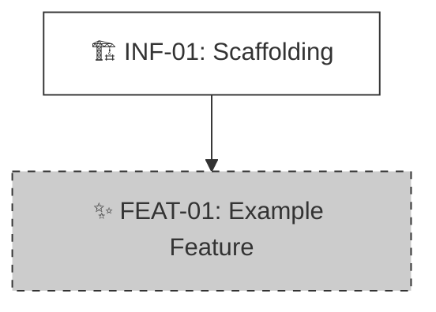

# Product Roadmap

> **Status:** [Planning]
> **Last Updated:** YYYY-MM-DD

---

## 🗺️ Master Plan

### 📊 Dependency Graph (Parallelism Analysis)

> **Legend**:
> * ✅ **Done**: Completed/Deployed.
> * 🟢 **Active**: In Progress (Current Focus).
> * ⏳ **Pending**: Backlog, dependencies ready.
> * 🧱 **Blocked**: Waiting for prerequisites.

<!-- VISUAL_START -->

<!-- VISUAL_END -->

### 📝 Task List

<!-- TASKS_START -->
## 🚀 Phase 1: Infrastructure
- [ ] ⏳ **[INF-01]** Project Scaffolding
  - 🎯 Goal: Initialize repo, linter, tests, and core utils (DoD: `npm test` passes).
  - 🔗 Dep: None
  - 🏷️ Tag: Infra
  - 📁 Slug: Project_Scaffolding

## 🧩 Phase 2: Core Features
- [ ] 🧱 **[FEAT-01]** Example Feature
  - 🎯 Goal: Implement basic feature logic.
  - 🔗 Dep: [INF-01]
  - 🏷️ Tag: Core
  - 📁 Slug: Example_Feature
<!-- TASKS_END -->

---

## 🤖 AI Maintenance Guide

**Trigger**: After every execution of `/archi.plan` or `npx archi task`.

1.  **CLI Validation**:
    *   AI generates content, CLI (`archi task --check`) validates format.
    *   **Anti-Clobbering**: DO NOT delete anchors like `<!-- TASKS_START -->`.

2.  **Status Sync**:
    *   **List**: Use `[x] ✅`, `[ ] 🟢`, `[ ] ⏳`, `[ ] 🧱`.
    *   **Graph**: Must apply corresponding `class` in Mermaid (done/active/pending/blocked).
    *   **Status Lifecycle**:

        | Transition | Trigger | CLI Command |
        |:---|:---|:---|
        | `[initial]` -> `pending` | `/archi.start` creates task with `Dep: None` or all Deps completed | - |
        | `[initial]` -> `blocked` | `/archi.start` creates task with unresolved Deps | - |
        | `blocked` -> `pending` | All Dep tasks become `done` | `npx archi task <ID> --status pending` |
        | `pending` -> `active` | `/archi.plan` completes feature planning | `npx archi task <ID> --status active` |
        | `active` -> `done` | `/archi.code` completes implementation | `npx archi task <ID> --status done` |

    *   **Gate Rules**:
        *   Only tasks with `active` status can execute `/archi.code`.
        *   Only tasks with `pending` status (dependencies ready) can execute `/archi.plan`.
        *   `blocked` tasks cannot be planned or coded directly; dependencies must be completed first.

3.  **Dependency Logic**:
    *   **Unblock**: When all `Dep` are done, update blocked tasks from 🧱 to ⏳.

4.  **Graph vs Dep (Edges vs Dependency Field)**:
    *   **Dep field**: Complete logical dependency list (including indirect/transitive deps), used for scheduling and blocking.
    *   **Mermaid edges**: Only draw **direct, nearest** prerequisites to keep the graph clean and readable.
    *   Do **NOT** draw edges for every entry in the Dep field.
    *   **Arrow Direction (Critical)**: Arrows represent **execution order**, pointing from prerequisite to dependent task (do first --> do next). Never reverse.
        *   Correct: `INF-01 --> FEAT-01` (infra first, then feature)
        *   Wrong: `FEAT-01 --> INF-01` (forbidden: feature pointing to infra)
    *   Example: A.Dep=[B,C], B.Dep=[C] — graph draws `C --> B --> A` (execution order: C then B then A) only, not `C --> A`.
