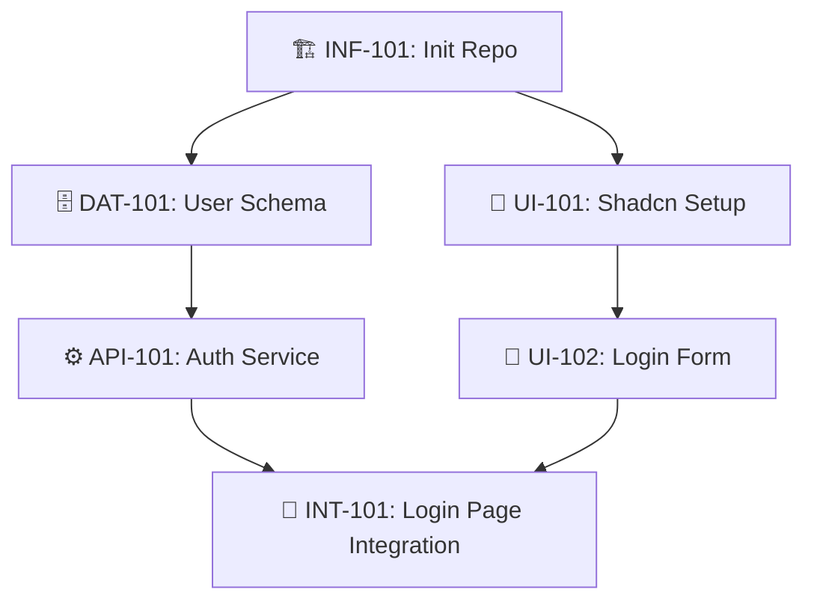

# Product Roadmap

> **Status:** [Planning]
> **Last Updated:** YYYY-MM-DD

---

## 🗺️ Master Plan (Global Planning & Dependencies)

### 📊 Dependency Graph (Parallelism Analysis)
> **Legend**:
> * ✅ **Done**: Deployed.
> * 🚧 **WIP**: In Development (Current Focus).
> * ⏳ **Pending**: Backlog, dependencies ready, ready to start.
> * 🔒 **Blocked**: Blocked, waiting for prerequisites.

<!-- 
[AI Instruction]: 
Generate a Mermaid DAG to visualize dependencies and parallel tracks.
Nodes: [ID] Name
Shape: Box for Pending, Rounded for Done.
-->

### Phase 1 [INF]: Infrastructure
*(AI: Plan Tech Stack, CI/CD, Test Setup here)*

### Phase 2 [CORE]: Core Features
*(AI: Plan Step 1 Features here)*

### Phase 3 [EXT]: Extensions
*(AI: Plan Scale & UX enhancements here)*

<!-- Example Format:
- [ ] ⏳ **[INF-101] Database Infrastructure**
    - **Goal**: Setup Postgres + Prisma environment, ensure connection and migration.
    - **Dep**: None
- [ ] 🔒 **[FEAT-201] Order Flow**
    - **Goal**: Implement order placement, payment, and status transitions (Full Stack).
    - **Dep**: [INF-101]
-->

---

## 🤖 AI Maintenance Guide

**Trigger**: After every execution of `/archi.plan` or `/archi.code`.

1.  **Dependency Visualization (Mermaid)**:
    *   **Sync**: Update the `graph TD` code block whenever task status changes.
    *   **Style**: Pending=`[ ]`, WIP=`style [ID] fill:#f9f,stroke:#333`, Done=`style [ID] fill:#9f9,stroke:#333`.
2.  **ID Prefix Enforcement**:
    *   `[INF]`: Infrastructure
    *   `[DAT]`: Data
    *   `[API]`: API
    *   `[UI]`: UI
    *   `[INT]`: Integration
    *   `[FEAT]`: Business Feature
3.  **Queue Logic**:
    *   **Unblock**: When all `Dep` dependencies of a task are marked as ✅, immediately update its status to ⏳ **Pending**.
