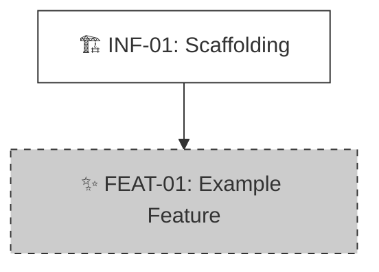

# Product Roadmap

> **Status:** [Planning]
> **Last Updated:** YYYY-MM-DD

---

## 🗺️ Master Plan (全局規劃與依賴)

### 📊 Dependency Graph (Parallelism Analysis)

> **Legend (圖例)**:
> * ✅ **Done**: 已完成/已上線。
> * 🟢 **Active**: 正在進行中 (Current Focus)。
> * ⏳ **Pending**: 待辦，依賴項已就緒。
> * 🧱 **Blocked**: 阻塞中，需等待前置依賴。

<!-- VISUAL_START -->

<!-- VISUAL_END -->

### 📝 Task List (任務清單)

<!-- TASKS_START -->
## 🚀 Phase 1: Infrastructure (基建)
- [ ] ⏳ **[INF-01]** Project Scaffolding
  - 🎯 Goal: 初始化倉庫、Linter、測試環境與核心工具函數 (DoD: `npm test` 通過)。
  - 🔗 Dep: None
  - 🏷️ Tag: Infra
  - 📁 Slug: Project_Scaffolding

## 🧩 Phase 2: Core Features (核心功能)
- [ ] 🧱 **[FEAT-01]** Example Feature
  - 🎯 Goal: 實現基礎功能邏輯。
  - 🔗 Dep: [INF-01]
  - 🏷️ Tag: Core
  - 📁 Slug: Example_Feature
<!-- TASKS_END -->

---

## 🤖 AI Maintenance Guide

**Trigger**: 每次執行 `/archi.plan` 或 `npx archi task` 後。

1.  **CLI Validation**:
    *   AI 負責生成內容，CLI (`archi task --check`) 負責校驗格式。
    *   **Anti-Clobbering**: 嚴禁刪除 `<!-- TASKS_START -->` 等錨點。

2.  **Status Sync**:
    *   **List**: 使用 `[x] ✅`, `[ ] 🟢`, `[ ] ⏳`, `[ ] 🧱`。
    *   **Graph**: 必須在 Mermaid 中應用對應的 `class` (done/active/pending/blocked)。
    *   **Status Lifecycle (狀態生命週期)**:

        | 轉換 | 觸發條件 | CLI 命令 |
        |:---|:---|:---|
        | `[初始]` -> `pending` | `/archi.start` 建立任務，且 `Dep: None` 或所有 Dep 已完成 | - |
        | `[初始]` -> `blocked` | `/archi.start` 建立任務，且有未完成的 Dep | - |
        | `blocked` -> `pending` | 所有 Dep 任務變為 `done` 時 | `npx archi task <ID> --status pending` |
        | `pending` -> `active` | `/archi.plan` 完成功能規劃後 | `npx archi task <ID> --status active` |
        | `active` -> `done` | `/archi.code` 完成功能實現後 | `npx archi task <ID> --status done` |

    *   **Gate Rules (門禁規則)**:
        *   只有 `active` 狀態的任務才能執行 `/archi.code`。
        *   只有 `pending` 狀態（依賴已就緒）的任務才能執行 `/archi.plan`。
        *   `blocked` 狀態的任務不能直接 plan 或 code，必須先等待依賴完成。

3.  **Dependency Logic**:
    *   **Unblock**: 當 `Dep` 全部完成時，將後續任務從 🧱 改為 ⏳。

4.  **Graph vs Dep (圖邊 vs 依賴欄位)**:
    *   **Dep 欄位**: 完整的邏輯依賴列表（含間接/傳遞依賴），用於任務調度與阻塞判斷。
    *   **Mermaid 圖邊**: 只畫**直接的、最近的**前置依賴，保持圖的清晰可讀。
    *   **嚴禁**將 Dep 欄位中的所有條目都畫成圖中的邊。
    *   **箭頭方向（關鍵）**: 箭頭代表**執行順序**，從前置任務指向後續任務（先做 --> 後做）。禁反向。
        *   正確: `INF-01 --> FEAT-01`（先做基建，再做功能）
        *   錯誤: `FEAT-01 --> INF-01`（禁：功能指向基建）
    *   例：A.Dep=[B,C]，B.Dep=[C]，圖中只畫 `C --> B --> A`（執行順序：先C再B再A），不畫 `C --> A`。
