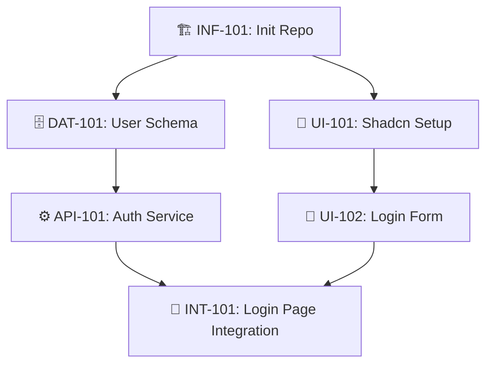

# Product Roadmap

> **Status:** [Planning]
> **Last Updated:** YYYY-MM-DD

---

## 🗺️ Master Plan (全局規劃與依賴)

### 📊 Dependency Graph (Parallelism Analysis)
> **Legend (圖例)**:
> * ✅ **Done**: 已上線。
> * 🚧 **WIP**: 正在開發中 (Current Focus)。
> * ⏳ **Pending**: 待辦，依賴項已就緒，隨時可做。
> * 🔒 **Blocked**: 阻塞中，需等待前置依賴完成。

<!-- 
[AI Instruction]: 
Generate a Mermaid DAG to visualize dependencies and parallel tracks.
Nodes: [ID] Name
Shape: Box for Pending, Rounded for Done.
-->

### Phase 1 [INF]: Infrastructure (基建)
*(AI: Plan Tech Stack, CI/CD, Test Setup here)*

### Phase 2 [CORE]: Core Features (核心功能)
*(AI: Plan Step 1 Features here)*

### Phase 3 [EXT]: Extensions (擴展與優化)
*(AI: Plan Scale & UX enhancements here)*

<!-- 示例格式:
- [ ] ⏳ **[INF-101] 資料庫基建**
    - **Goal**: 搭建 Postgres + Prisma 環境，確保能連接並遷移。
    - **Dep**: None
- [ ] 🔒 **[FEAT-201] 訂單流程**
    - **Goal**: 實現下單、支付、狀態流轉 (Full Stack)。
    - **Dep**: [INF-101]
-->

---

## 🤖 AI Maintenance Guide

**Trigger**: 每次執行 `/archi.plan` 或 `/archi.code` 後。

1.  **Dependency Visualization (Mermaid)**:
    *   **Sync**: 每次任務狀態變更時，必須更新 `graph TD` 代碼塊。
    *   **Style**: Pending=`[ ]`, WIP=`style [ID] fill:#f9f,stroke:#333`, Done=`style [ID] fill:#9f9,stroke:#333`.
2.  **ID Prefix Enforcement**:
    *   `[INF]`: Infrastructure
    *   `[DAT]`: Data
    *   `[API]`: API
    *   `[UI]`: UI
    *   `[INT]`: Integration
    *   `[FEAT]`: Business Feature
3.  **Queue Logic**:
    *   **Unblock**: 當某任務依賴的所有 `Dep` 都標記為 ✅ 時，立即將其狀態更新為 ⏳ **Pending**。
