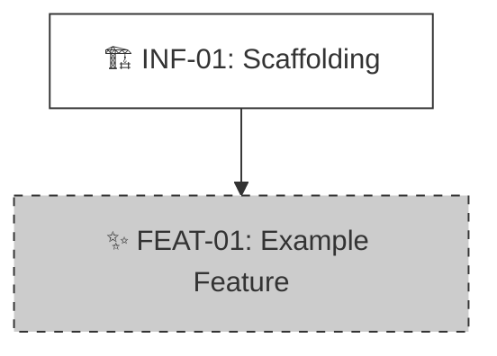

# Product Roadmap

> **Status:** [Planning]
> **Last Updated:** YYYY-MM-DD

---

## 🗺️ Master Plan (全局规划与依赖)

### 📊 Dependency Graph (Parallelism Analysis)

> **Legend (图例)**:
> * ✅ **Done**: 已完成/已上线。
> * 🟢 **Active**: 正在进行中 (Current Focus)。
> * ⏳ **Pending**: 待办，依赖项已就绪。
> * 🧱 **Blocked**: 阻塞中，需等待前置依赖。

<!-- VISUAL_START -->

<!-- VISUAL_END -->

### 📝 Task List (任务清单)

<!-- TASKS_START -->
## 🚀 Phase 1: Infrastructure (基建)
- [ ] ⏳ **[INF-01]** Project Scaffolding
  - 🎯 Goal: 初始化仓库、Linter、测试环境与核心工具函数 (DoD: `npm test` 通过)。
  - 🔗 Dep: None
  - 🏷️ Tag: Infra
  - 📁 Slug: Project_Scaffolding

## 🧩 Phase 2: Core Features (核心功能)
- [ ] 🧱 **[FEAT-01]** Example Feature
  - 🎯 Goal: 实现基础功能逻辑。
  - 🔗 Dep: [INF-01]
  - 🏷️ Tag: Core
  - 📁 Slug: Example_Feature
<!-- TASKS_END -->

---

## 🤖 AI Maintenance Guide

**Trigger**: 每次执行 `/archi.plan` 或 `npx archi task` 后。

1.  **CLI Validation**:
    *   AI 负责生成内容，CLI (`archi task --check`) 负责校验格式。
    *   **Anti-Clobbering**: 严禁删除 `<!-- TASKS_START -->` 等锚点。

2.  **Status Sync**:
    *   **List**: 使用 `[x] ✅`, `[ ] 🟢`, `[ ] ⏳`, `[ ] 🧱`。
    *   **Graph**: 必须在 Mermaid 中应用对应的 `class` (done/active/pending/blocked)。
    *   **Status Lifecycle (状态生命周期)**:

        | 转换 | 触发条件 | CLI 命令 |
        |:---|:---|:---|
        | `[初始]` -> `pending` | `/archi.start` 创建任务，且 `Dep: None` 或所有 Dep 已完成 | - |
        | `[初始]` -> `blocked` | `/archi.start` 创建任务，且有未完成的 Dep | - |
        | `blocked` -> `pending` | 所有 Dep 任务变为 `done` 时 | `npx archi task <ID> --status pending` |
        | `pending` -> `active` | `/archi.plan` 完成功能规划后 | `npx archi task <ID> --status active` |
        | `active` -> `done` | `/archi.code` 完成功能实现后 | `npx archi task <ID> --status done` |

    *   **Gate Rules (门禁规则)**:
        *   只有 `active` 状态的任务才能执行 `/archi.code`。
        *   只有 `pending` 状态（依赖已就绪）的任务才能执行 `/archi.plan`。
        *   `blocked` 状态的任务不能直接 plan 或 code，必须先等待依赖完成。

3.  **Dependency Logic**:
    *   **Unblock**: 当 `Dep` 全部完成时，将后续任务从 🧱 改为 ⏳。

4.  **Graph vs Dep (图边 vs 依赖字段)**:
    *   **Dep 字段**: 完整的逻辑依赖列表（含间接/传递依赖），用于任务调度与阻塞判断。
    *   **Mermaid 图边**: 只画**直接的、最近的**前置依赖，保持图的清晰可读。
    *   **严禁**将 Dep 字段中的所有条目都画成图中的边。
    *   例：A.Dep=[B,C]，B.Dep=[C]，图中只画 `C --> B --> A`，不画 `C --> A`。
